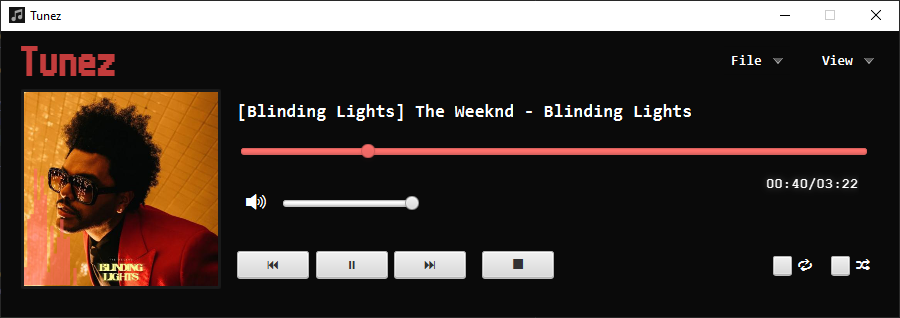

# Tunez #

## About ##

Tunez is a simple Music Media Player. It can play `.mp3` and `.wav` files and supports all media commands such as play, pause, skip, track seeking, etc.

Also displays an audio spectrum visualizer along with any metadata found in the music files such as album, artist, title, and album art.

## Dependencies ##

The application is coded in Java using JavaFX and FXML files. I am currently trying to package the whole application into a `.jar` executable but there are some issues arised by the Apache NetBeans IDE and the platform I am developing on.

Hence when the executable is available, the only dependency is that the latest version of [Java](https://java.com/en/download/help/download_options.xml) needs to be installed on your computer.

## License ## 

[GPLv3 Licensing Information](https://github.com/sharvenp/Tunez/blob/master/LICENSE.md)
